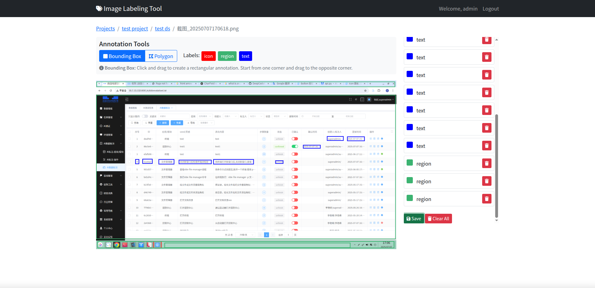

# Image Labeling Tool

A web-based image annotation platform built with Django for creating machine learning datasets.


## UI Preview



## Features

- **Project-based organization** - Organize annotations by projects and datasets
- **Multi-format support** - Handle images (JPG, PNG, BMP, TIFF) and videos (MP4, AVI, MOV, MKV)
- **Interactive annotation** - Canvas-based annotation interface with bounding box tools
- **User management** - Multi-user support with authentication
- **Export capabilities** - Export to COCO and YOLO formats
- **Batch upload** - Upload multiple images at once
- **Annotation tracking** - Track progress and statistics

## Technology Stack

- **Backend**: Django 5.2+ (Python)
- **Frontend**: Bootstrap 5, JavaScript (ES6+), SVG Canvas
- **Database**: SQLite (default) / PostgreSQL (production)

## Quick Start

### 1. Clone and Setup
```bash
git clone <repository-url>
cd annotation
python -m venv venv
source venv/bin/activate  # On Windows: venv\Scripts\activate
```

### 2. Install Dependencies
```bash
pip install django pillow
```

### 3. Setup Database
```bash
python manage.py migrate
python manage.py createsuperuser
```

### 4. Run Application
```bash
python manage.py runserver
```

Access the application at http://localhost:8000

## Usage

1. **Login** and create a new project
2. **Add label categories** through the admin interface
3. **Create a dataset** and upload images
4. **Start annotating** using the interactive canvas
5. **Export** your dataset in COCO or YOLO format

## Project Structure

```
annotation/
├── annotation/           # Django project settings
├── labeling/            # Main application
│   ├── models/          # Data models
│   ├── views/           # View logic
│   ├── templates/       # HTML templates
│   └── static/          # CSS, JS, images
├── media/               # Uploaded files
└── manage.py            # Django management
```

## Configuration

Create a `.env` file for environment variables:

```bash
SECRET_KEY=your-secret-key-here
DEBUG=True
ALLOWED_HOSTS=localhost,127.0.0.1
```

## Development

```bash
# Run tests
python manage.py test

# Create migrations
python manage.py makemigrations

# Collect static files
python manage.py collectstatic
```

## License

This project is licensed under the MIT License.

---

**Made with ❤️ for the Computer Vision Community**